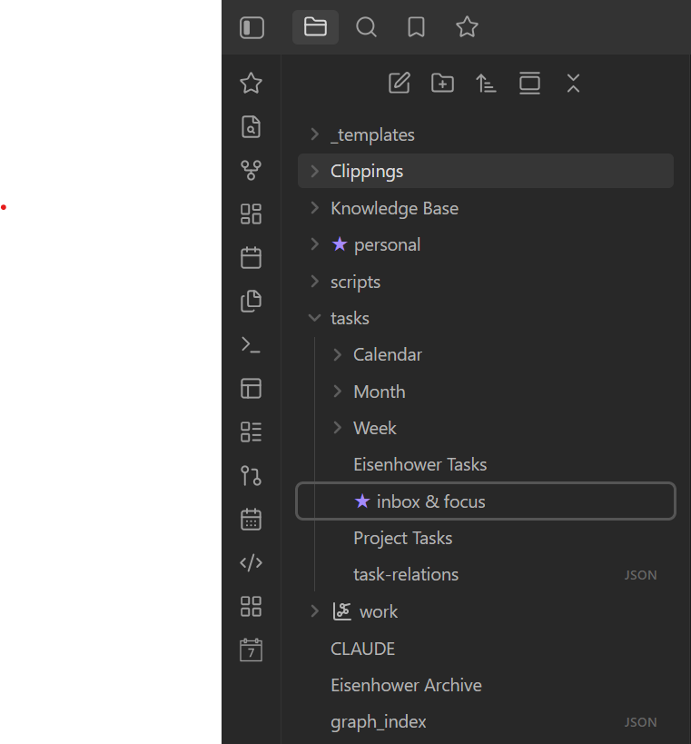
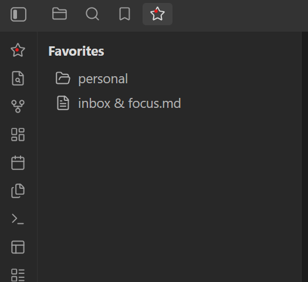

# Star Favorites

Star your favorite notes and folders straight from the right-click menu, and jump back to them from a dedicated Star Favorites pane.

Repository: [github.com/bugrasitemkar/star-favorites](https://github.com/bugrasitemkar/star-favorites)

## Features

- Right-click any note or folder (in the file explorer, or a note's tab) and choose **Add to favorites**. Once favorited, the same menu shows **Remove from favorites**.
- Favorited notes and folders get a ★ prefixed to their name in the file explorer.
- Click the star icon in the left ribbon (or run the **Open favorites view** command) to open a Star Favorites pane in the left sidebar listing every starred note and folder. Click an entry to open the note or reveal the folder; right-click an entry to unfavorite it.
- Favorites follow renames and moves automatically, and are cleaned up when the underlying file or folder is deleted.
- Multi-select support: select several files/folders in the explorer and add or remove them from favorites in one click.

The ★ marker is shown in the file explorer only (not in tabs, search, or backlink panes).

## Screenshots

| Starred items in the file explorer | Favorites pane |
| --- | --- |
|  |  |

## Installing for development

```bash
npm install
npm run dev
```

This watches `main.ts` and rebuilds `main.js` on save. To test inside a vault, either:

- Clone/copy this folder into `<YourVault>/.obsidian/plugins/star-favorites`, or
- Symlink this folder into `<YourVault>/.obsidian/plugins/star-favorites`.

Then reload Obsidian (or use the "Reload app without saving" command) and enable **Star Favorites** under Settings → Community plugins.

## Building for release

```bash
npm run build
```

This type-checks the project and produces a production `main.js`.

## Publishing to the Community Plugins directory

1. Push this repository to `github.com/bugrasitemkar/star-favorites`.
2. Create a GitHub release whose **tag matches `manifest.json`'s `version`** (e.g. `1.0.0`, no leading `v`), and attach `main.js`, `manifest.json`, and `styles.css` as binary attachments to the release.
3. Fork [`obsidianmd/obsidian-releases`](https://github.com/obsidianmd/obsidian-releases), add an entry for `star-favorites` to `community-plugins.json`, and open a pull request following their submission guidelines.
4. Bump future versions with `npm version <patch|minor|major>`, which updates `manifest.json` and `versions.json` via `version-bump.mjs`.

## License

MIT
